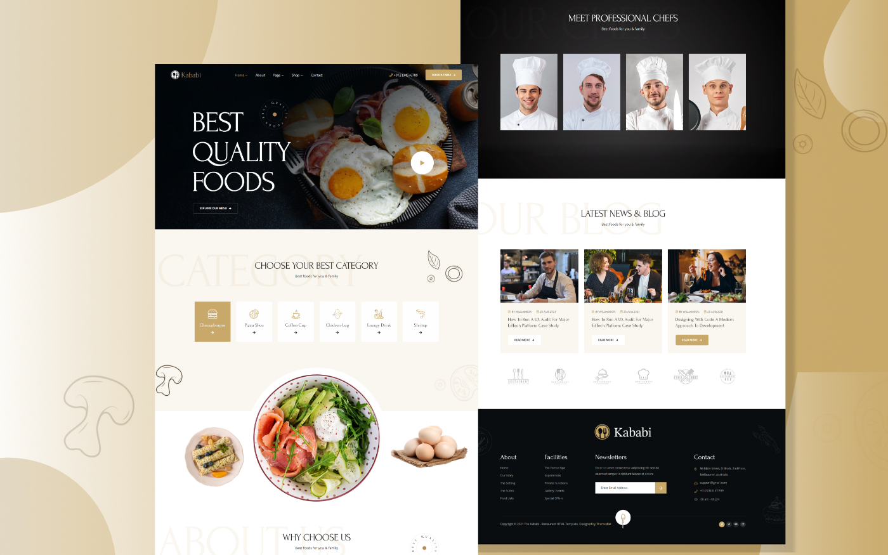

# Kababi-food
A restaurant has reached out to you, and they want you to implement the design that already have prepared for you.

They already have prepared all images and resources for you, so all you have to do is use them.

Your team has a total of 3-4 days, with the power of flexbox, grid and positioning, you should be able to make it.

## Screenshots

## Badges

## work progress

This project was made in September 2023 during a formation at BeCode. 

## Authors
- [@Okly](https://github.com/Okly2023)
- And me

